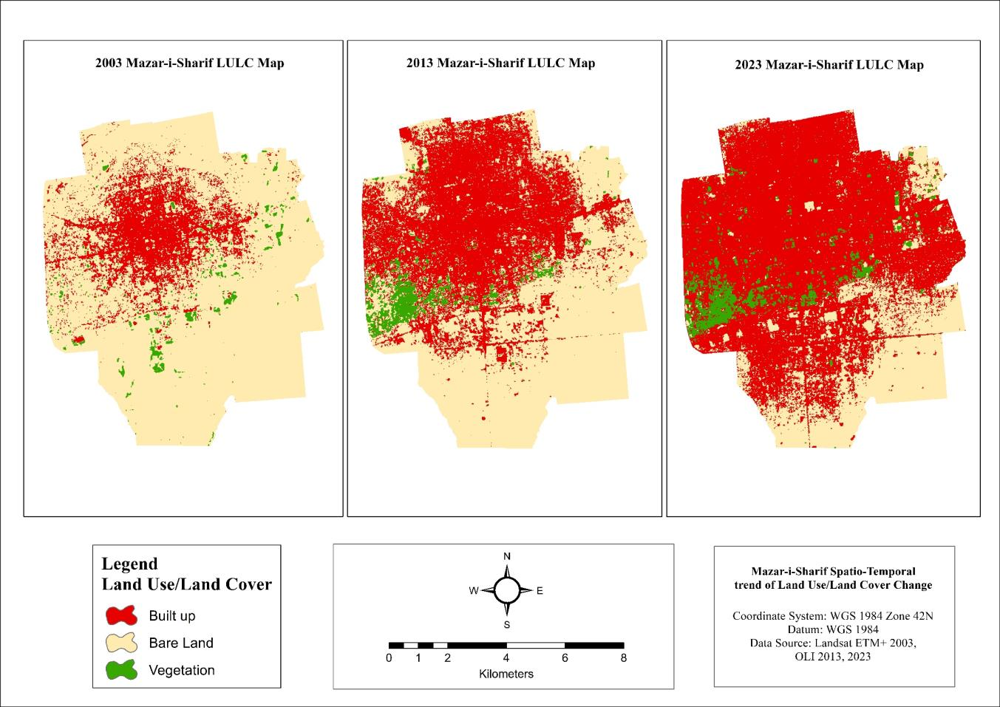
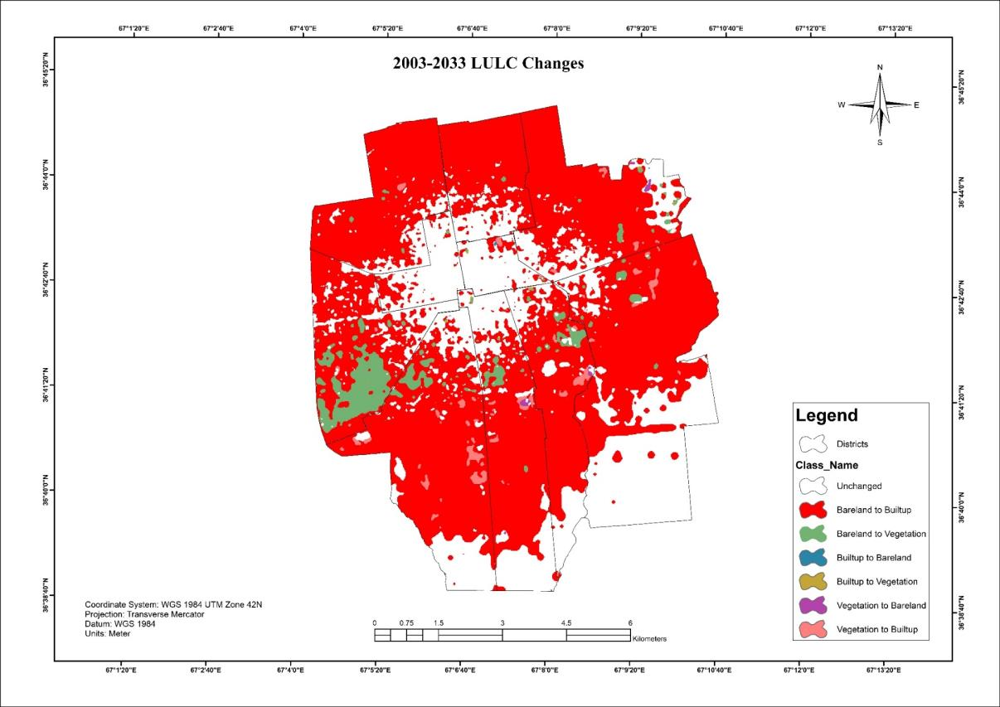
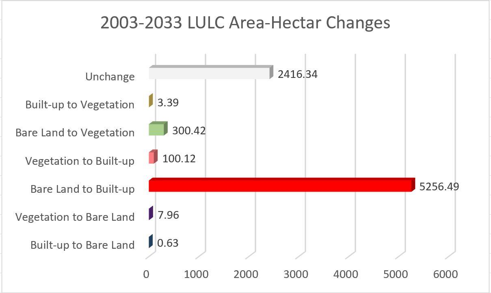
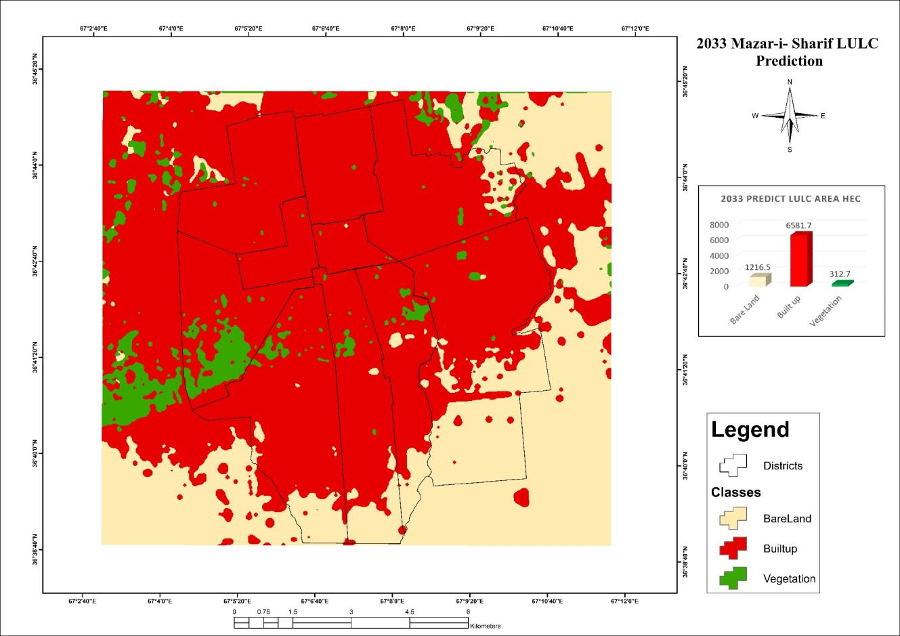

# Urban Growth Prediction of Mazar-e-Sharif City Using an Integrated Cellular Automata and Markov Chain Model 

## Overview

This project analyzes the spatial expansion of Mazar-e-Sharif
between 2003 and 2023 and projects potential urban growth
to 2033.

## Objectives

- Analyze historical urban expansion
- Identify land-use/land-cover changes
- Model future urban growth
- Visualize spatial patterns of expansion

## Data

- Landsat satellite imagery
- Land-use/land-cover data
- Administrative boundary data

## Methodology

1. Satellite image preprocessing
2. Land-use/land-cover classification
3. Change detection
4. Markov Chain analysis
5. Cellular Automata modeling
6. 2033 urban growth prediction

## Results

Built-up area increased from approximately 1,318 ha
in 2003 to 5,496 ha in 2023.

The model projected approximately 6,582 ha of built-up
area by 2033.

## Software

- ArcGIS Pro
- TerrSet / CA-Markov
- ENVI

## Urban Growth Maps

### LULC Maps

### LULC Changes

### LULC Changes Charts

### 2033 Prediction

## Limitations

The prediction represents a modeled future scenario and
depends on historical land-use transition patterns and
the assumptions of the modeling approach.
